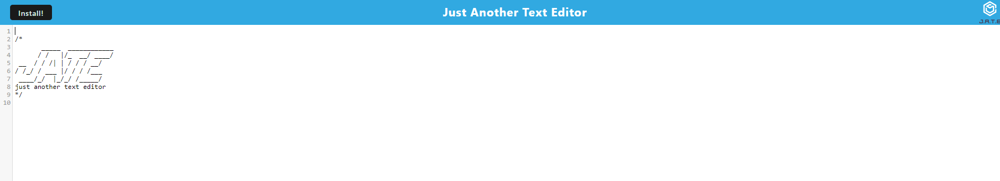

# PWA-Text-Editor

## Description

NoteFlow is a versatile text editor tailored for seamless note-taking and code snippet management, whether you’re online or offline. With NoteFlow, you can effortlessly create, organize, and retrieve your notes and code snippets from any device, ensuring that your important information is always within reach.

## Installation and Usage

- After cloning the repository
- Run npm run install in the terminal
- After installation type in the terminal: npm run start
 Here is how the website will look like! 

 

 ## Resources

 ChatGPT, Classroom activities, TA's (Mary) 

 ## Links 

 Repository Link: https://github.com/Alondra1752/Text-Editor

 Render Link: https://pwa-text-editor-1-ntrf.onrender.com

## License

This project is licensed under MIT License. For more information please click on the badge below: 

 
 
